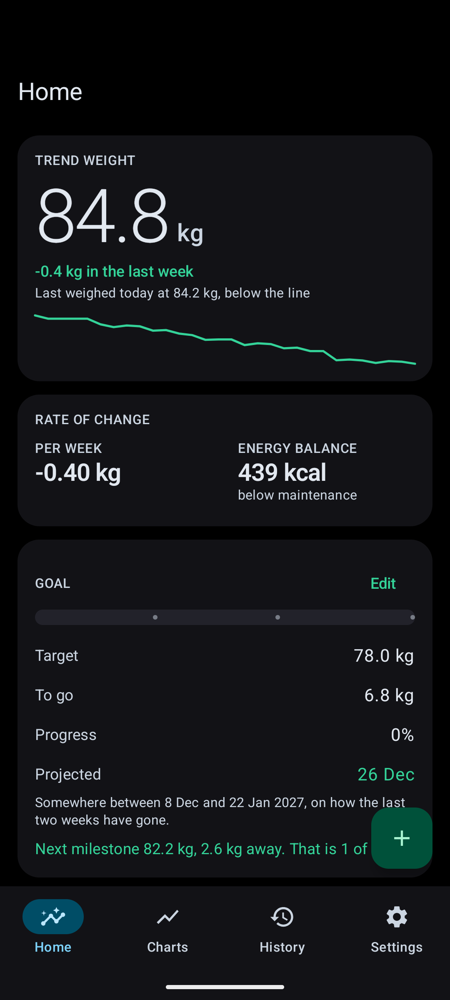
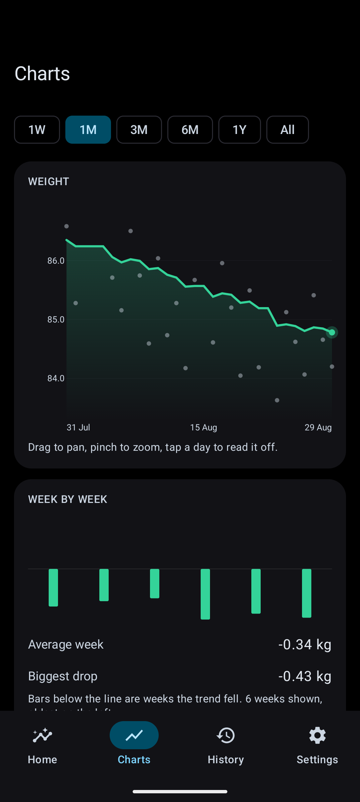
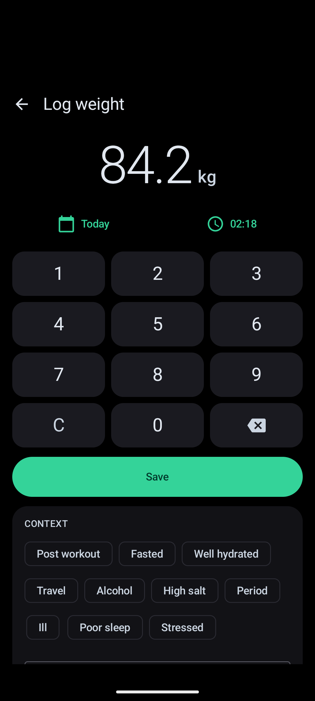
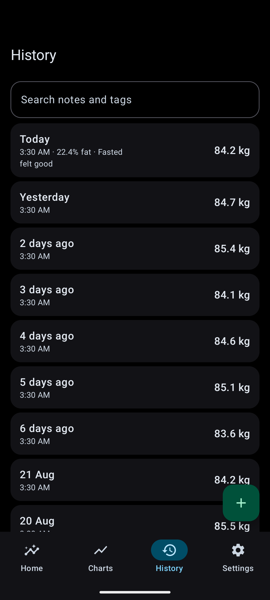

<p align="center">
  
  
  
  
</p>

# WeightTrack v0.1.0

A free, open-source Android app for tracking weight loss. No subscription, no account, no ads. Your readings stay on your phone and leave only when you export them.

Most weight apps hide the trend line, the goal projection, body measurements or a working export behind a monthly plan. MyFitnessPal even took the barcode scanner away from people who had used it free for a decade. WeightTrack ships the lot for nothing, and the MIT licence means it cannot be taken back later.

## Screenshots

| Home | Charts | Log | History |
|---|---|---|---|
|  |  |  |  |

## What it does

**The trend, not the noise.** Your weight swings a kilogram or two a day on water alone. WeightTrack draws the raw readings faded behind a smoothed line, so what you see is the direction you are actually going. The smoothing is the Hacker's Diet exponential moving average, made gap-aware: come back after three weeks off and the line catches up properly instead of pretending nothing happened.

**A goal date you can believe.** The app fits a line to your recent trend and works out when you would reach your target at that rate, with a range around it rather than one falsely precise day. If the trend is flat, or heading the wrong way, it says so instead of inventing a date in 2071.

**Milestones.** A 20 kg goal is discouraging. The next 2 kg is not. WeightTrack splits the journey automatically and marks each one off against the smoothed line, so a single dehydrated morning cannot award a milestone that gets taken back tomorrow.

**Everything else that usually costs money:**

- Body measurements with a US Navy body fat estimate, lean and fat mass, and waist-to-height ratio
- BMI with your healthy weight range, plus BMR and maintenance calories (Mifflin-St Jeor, or Katch-McArdle once body fat is known)
- Rate of change per week and the daily calorie balance it implies
- Plateau detection that explains what a plateau actually is
- Week-by-week change bars, and a weekday pattern that shows whether Mondays always read heavy
- Health Connect sync in both directions, so a Withings, Renpho, Samsung or Fitbit scale lands in the app on its own
- CSV import that reads exports from Libra, Happy Scale, openScale, MyFitnessPal, Renpho, Withings and most others
- CSV and JSON export, and a full backup that restores readings, measurements, goal and settings
- A home screen widget, and a daily reminder that stays quiet on days you have already weighed in
- AMOLED black by default, with light, dark and wallpaper-colour themes

## What it will not do

No ads. No subscription. No account. No analytics. No proprietary cloud. No AI coach. Cloud backup is switched off deliberately, which is why the export has to be good.

## Installing

Grab the APK from [Releases](https://github.com/SysAdminDoc/WeightTrack/releases). An F-Droid build is planned.

## Building

Needs Android Studio or the command line SDK, with JDK 17 or newer.

```
./gradlew assemblePlayDebug     # Play flavour
./gradlew assembleFossDebug     # F-Droid flavour, no Google dependencies
./gradlew testPlayDebugUnitTest # 157 unit tests
```

Release builds are signed locally with a keystore described by `keystore.properties` in the repo root.

## How it is put together

Kotlin, Jetpack Compose and Material 3, Room, Hilt, DataStore, WorkManager, Glance. Min SDK 26, target 37.

The maths lives in `core/math` with no Android dependencies: the trend engine, goal projection, milestones, body composition formulas and unit conversion are all plain Kotlin and all covered by tests. Weight is stored as whole grams, so switching between kilograms, pounds and stones never changes a stored reading.

The chart is drawn directly on a Compose canvas rather than through a charting library, which is what lets the raw readings, the trend line, the goal line and the milestone marks share one coordinate space exactly.

## Roadmap

See [ROADMAP.md](ROADMAP.md). Next up: Wear OS, progress photos, Bluetooth scales and an optional food log.

## License

MIT. See [LICENSE](LICENSE).
