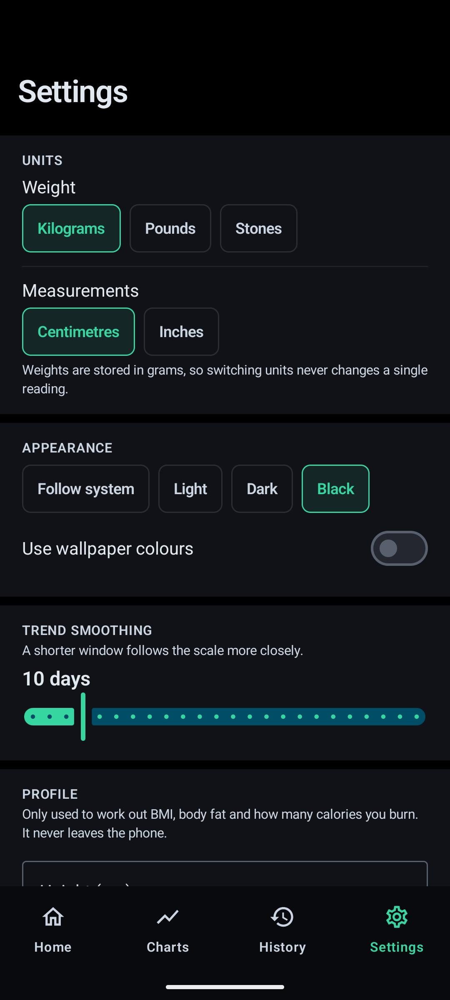
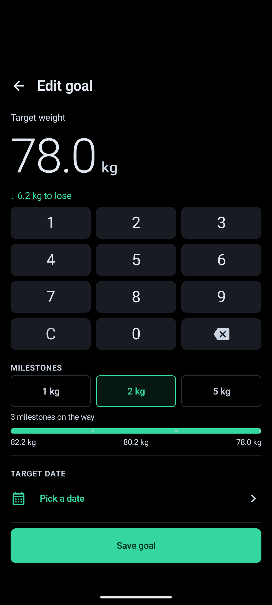
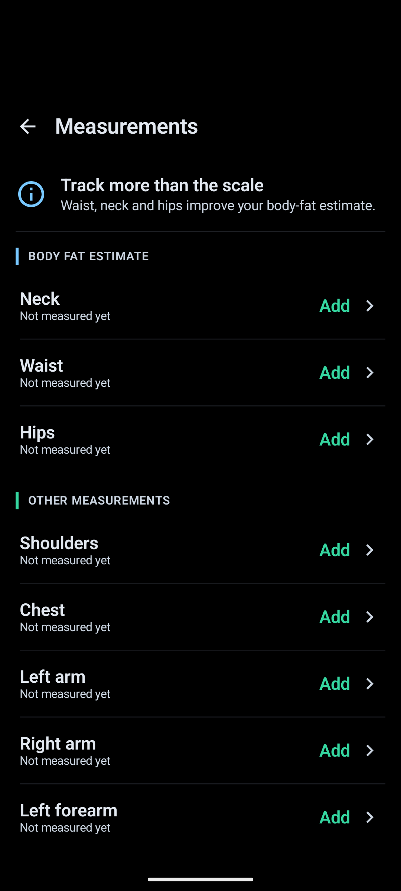
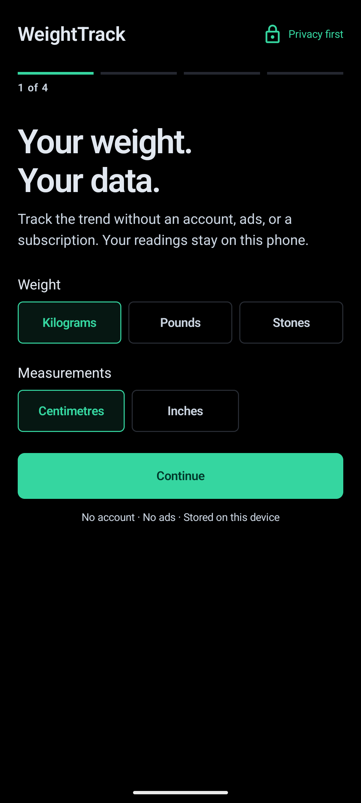

<p align="center">
  
  
  
  
</p>

# WeightTrack v0.4.0

A free, open-source Android app for tracking weight loss. No subscription, no account, no ads. Your readings stay on your phone and leave only when you export them.

Version 0.4.0 brings a quieter AMOLED interface to every main screen. The trend stays prominent, controls take less room, and the common jobs remain reachable without hunting through cards.

Most weight apps hide the trend line, the goal projection, body measurements or a working export behind a monthly plan. MyFitnessPal even took the barcode scanner away from people who had used it free for a decade. WeightTrack ships the lot for nothing, and the MIT licence means it cannot be taken back later.

## Screenshots

| Home | Charts | Log | History |
|---|---|---|---|
|  |  |  |  |

| Settings | Edit goal | Measurements | Onboarding |
|---|---|---|---|
|  |  |  |  |

## What it does

**The trend, not the noise.** Your weight swings a kilogram or two a day on water alone. WeightTrack draws the raw readings faded behind a smoothed line, so what you see is the direction you are actually going. The default smoothing is the Hacker's Diet exponential moving average, made gap-aware: come back after three weeks off and the line catches up properly instead of pretending nothing happened. There is a second mode in Settings that carries the direction you are heading alongside the weight, which keeps up with a steady loss rather than reading a few hundred grams high all the way through one. Whichever you pick is what your weekly figure, your milestones and your projected date are worked out from.

**A goal date you can believe.** The app fits a line to your recent trend and works out when you would reach your target at that rate, with a range around it rather than one falsely precise day. If the trend is flat, or heading the wrong way, it says so instead of inventing a date in 2071. Tap the date and it shows its working: the days it used, the rate it found and the spread, so you can judge the answer rather than take it on faith.

**Milestones.** A 20 kg goal is discouraging. The next 2 kg is not. WeightTrack splits the journey automatically and marks each one off against the smoothed line, so a single dehydrated morning cannot award a milestone that gets taken back tomorrow.

**Made for the scale at 7 AM.** The interface is true black by default, with large tabular numbers, compact controls and a log flow that keeps the keypad in reach. Every screen follows the same mint, blue and graphite system.

**Everything else that usually costs money:**

- Body measurements with a US Navy body fat estimate, lean and fat mass, and waist-to-height ratio
- BMI with your healthy weight range, plus BMR and maintenance calories (Mifflin-St Jeor, or Katch-McArdle once body fat is known)
- Rate of change per week and the daily calorie balance it implies
- Plateau detection that explains what a plateau actually is
- Week-by-week change bars, and a weekday pattern that shows whether Mondays always read heavy
- Health Connect sync in both directions, so a Withings, Renpho, Samsung or Fitbit scale lands in the app on its own, bringing your whole history across rather than the last month of it
- CSV import that reads exports from Libra, Happy Scale, openScale, MyFitnessPal, Renpho, Withings and most others, while reporting unsupported weights and dates instead of saving them
- CSV and JSON export, and a full backup that restores readings, measurements, goal and settings
- An encrypted archive that carries your progress photos as well, for moving to a new phone. AES-256-GCM under a password you choose, checked byte for byte on the way back in, and it holds no credentials
- A weekly copy of everything into a folder you choose, keeping the last four, since there is deliberately no cloud to fall back on
- Adaptive expenditure: what you actually burn, measured from your own weight and intake rather than a formula, and a calorie target that follows it
- An optional food diary: calories and macros by meal, daily targets in grams or percent with a different one for any day of the week, copy yesterday, and a quick add for the meal that has no label
- An optional food database with recipes, Open Food Facts lookups and no ads anywhere near it
- Twenty two thousand common products bundled in the app, so the barcode scanner works in a shop with no signal
- Sync between your own devices through a shared folder or your own Nextcloud, with no account and nothing of yours on anybody else's server
- A milestone card you can share, drawn on the phone, that says how far you have come without saying what you weigh
- Barcode scanning in both builds, ML Kit on Play and ZXing on F-Droid, so neither goes without it
- Profiles for a household, each with their own history, goal and reminder, and a shared scale that works out whose reading it just took
- Bluetooth scales, read straight into the log: the standard weight and body composition services, Xiaomi's broadcast format that needs no pairing, and the Renpho, eufy and Beurer/Sanitas protocols
- A Wear OS watch app: the trend on a tile and on a watch face, and a weight logged with the crown
- A home screen widget, and a daily reminder that stays quiet on days you have already weighed in
- An activity log that records what failed and why, holding no personal data at all, so a problem can be reported without sending your history with it
- Charts that describe themselves to a screen reader, so the main thing on the screen is not a silent blank to somebody using TalkBack
- AMOLED black by default, with light, dark and wallpaper-colour themes

## What it will not do

No ads. No subscription. No account. No analytics. No proprietary cloud. No automated coach. Cloud backup is switched off deliberately, which is why the export has to be good.

## Installing

Grab the APK from [Releases](https://github.com/SysAdminDoc/WeightTrack/releases). Each release
carries a `play` build, a `foss` build with no Google dependencies, and the watch app.

Every release also carries `SHA256SUMS.txt`. Check what you downloaded against it, and check the
signing certificate before you install:

```sh
sha256sum -c SHA256SUMS.txt
apksigner verify --verbose --print-certs WeightTrack-v0.4.0-play-release.apk
```

The fingerprint that comes back has to match the one published in
[SECURITY.md](SECURITY.md), which also records the retired key from v0.1.0 and v0.2.0 and what to
do if you're still on one of those.

## Building

Needs Android Studio or the command line SDK, with JDK 17 or newer.

```
./gradlew assemblePlayDebug       # Play flavour
./gradlew assembleFossDebug       # F-Droid flavour, no Google dependencies
./gradlew :wear:assembleDebug     # the watch app
./gradlew :app:testPlayDebugUnitTest # 1,176 Play-flavour tests
./gradlew :app:testFossDebugUnitTest # 1,182 F-Droid-flavour tests
./gradlew :core:testDebugUnitTest    # 440 for shared maths, import, scale, food and sync code
./gradlew :wear:testDebugUnitTest    # 19 for the watch
./gradlew checkFormFactorVersions    # build and verify the exact phone and watch version identity
```

There is a performance fixture for a history nobody wants to wait for the app to grow. It fills
the database with twenty years of daily weigh-ins, five years of meals and twenty years of monthly
measurements, then measures cold start, the chart, and switching the chart's range. It needs a
device or emulator attached:

```
$env:ANDROID_SERIAL = '<serial>'
./gradlew :benchmark:connectedBenchmarkAndroidTest `
  "-Pandroid.testInstrumentationRunnerArguments.androidx.benchmark.suppressErrors=EMULATOR,LOW-BATTERY,UNLOCKED,DEBUGGABLE,NOT-PROFILEABLE"
pwsh -NoProfile -File tools/check-benchmark-budgets.ps1
```

The suppressions are what let it run on an emulator at all. Numbers from one are noisy and slower
than any real phone, so the budgets in `tools/benchmark-budgets.json` are a regression guard
rather than a target: they are set from measured runs on one pinned emulator and mean nothing on
different hardware. Reset them when you change device. `tools/test-benchmark-budget-gate.ps1`
proves the check can fail.
Every normal build uses strict dependency locks and checks the SHA-256 of each downloaded plugin
or library. To review an intentional dependency update, regenerate the trust files from a fresh
cache and then run the negative trust checks:

```
pwsh -NoProfile -File tools/update-dependency-trust.ps1
pwsh -NoProfile -File tools/test-dependency-verification.ps1
```

The update command exercises unit and instrumentation paths plus every release assembly. Review
all lockfile and `gradle/verification-metadata.xml` changes before committing them. The test command
must report that Gradle refused both a forced transitive-version change and an altered cached JAR.

Release builds are signed locally with a keystore described by `keystore.properties` in the repo root.
To cut a release, run the two commands below rather than assembling by hand. The first builds all
three APKs from clean, names them, writes `SHA256SUMS.txt` and then checks the whole directory
against `tools/release-trust.json`. The second proves that gate can still fail.

```
pwsh -NoProfile -File tools/prepare-release.ps1
pwsh -NoProfile -File tools/test-release-artifact-gate.ps1
```

The bundled offline food list is committed, so a normal build needs no network. To rebuild it from a fresh Open Food Facts export, run `py -3.13 tools/build_offline_foods.py`. That reads about 1.2 GB straight off the wire, keeps the most-scanned products per market and writes `app/src/main/assets/offline_foods.db` with a digest beside it.

## Translating

Every word the app shows lives in `app/src/main/res/values/strings.xml`. To add a language, copy that file to `values-<code>/strings.xml` and translate the values, leaving the names alone. Placeholders like `%1$s` have to stay, and they can move within a sentence if that reads better in your language, which is the reason whole sentences are kept in one string rather than glued together in code.

A test reads every Kotlin file in the app and fails the build if anybody adds text that cannot be translated, so the English file stays the complete list rather than drifting out of date. It covers the widgets, the notifications and the watch as well as the screens, and it catches a sentence put into a variable before it is shown. Debug builds carry Android's pseudo-languages: switch the app to "Accented English" in its language settings and anything still written in the source stands out as plain text among the decorated words.

Nothing ships in any language but English yet, and no machine translation is used here on purpose. This app tells people things about their own weight and eating, and wording that is almost right is worse than wording in a language they will at least read carefully.

Units are left as they are written in English. `kg`, `g`, `cm` and `ml` are the same symbols in every language by definition, and `lb`, `st`, `ft` and `in` are used in the places that read English anyway.

## How it is put together

Kotlin, Jetpack Compose and Material 3, Room, Hilt, DataStore, WorkManager, Glance. Min SDK 26, target 37.

The maths lives in its own `core` module with no Android dependencies: the trend engine, goal projection, milestones, body composition formulas and unit conversion are all plain Kotlin and all covered by tests. Weight is stored as whole grams, so switching between kilograms, pounds and stones never changes a stored reading.

The watch app is a separate module and a separate APK sharing the phone's application id, which is how Wear OS expects a companion to be published. It talks to the phone over the Data Layer, which is Google Play services, so the phone half of that lives in the Play flavour only and the F-Droid build carries no Google dependency and no watch.

The chart is drawn directly on a Compose canvas rather than through a charting library, which is what lets the raw readings, the trend line, the goal line and the milestone marks share one coordinate space exactly.

## Roadmap

See [ROADMAP.md](ROADMAP.md). Current work follows the reliability and interoperability backlog recorded there.

### How sync works

Each device writes one file, named after itself, into a folder you choose. It reads every other device's file from the same folder and merges them. Nothing ever writes to a file it did not create, which is what stops a folder sync tool producing conflict copies that somebody then has to arbitrate by hand.

Records are matched on an identifier that stays the same on every device, and the most recently changed version wins. Deletions are remembered for six months so they travel too, otherwise a phone that still holds the record hands it straight back.

What travels: weigh-ins, body measurements, water, fasts, goals, calorie and macro targets, your own foods, recipes and food diary, profiles, and the settings that describe you. What does not: progress photos, which are files rather than rows and travel in the encrypted archive instead. Whether a food is a favourite, and when you last ate it, stay on the phone that did the eating, because that is a fact about a phone rather than about the food.

If the server is on your own network rather than a hosted one, Android 17 and later ask your permission before the app may reach it. WeightTrack requests that only when the address really is a local one, and says so on the settings screen when it is missing.

Two other limits worth knowing. It relies on the devices roughly agreeing about the time, so a badly wrong clock can hold a stale edit in place. And a device left switched off for more than six months will bring back what it still holds, because by then the deletions that would have removed it have been forgotten.

## License

MIT. See [LICENSE](LICENSE).

The bundled food list and the online lookups both come from Open Food Facts, shared under the Open Database Licence. The app credits it wherever those products are shown.
